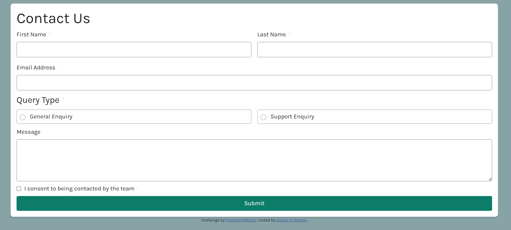

# Frontend Mentor - Contact form solution

This is a solution to the [Contact form challenge on Frontend Mentor](https://www.frontendmentor.io/challenges/contact-form--G-hYlqKJj). Frontend Mentor challenges help you improve your coding skills by building realistic projects. 

## Table of contents

- [Overview](#overview)
  - [The challenge](#the-challenge)
  - [Screenshot](#screenshot)
  - [Links](#links)
- [My process](#my-process)
  - [Built with](#built-with)
  - [What I learned](#what-i-learned)
  - [Continued development](#continued-development)
  - [Useful resources](#useful-resources)
- [Author](#author)

## Overview
This is a responsive contact form built with HTML, CSS, and JavaScript, designed to validate user input in real time. It includes input validation for text fields, radio buttons, checkboxes, and displays a success message upon correct submission. The form layout adjusts for mobile and desktop screens using CSS Flexbox and media queries.
 
### The challenge

Users should be able to:

- Complete the form and see a success toast message upon successful submission
- Receive form validation messages if:
  - A required field has been missed
  - The email address is not formatted correctly
- Complete the form only using their keyboard
- Have inputs, error messages, and the success message announced on their screen reader
- View the optimal layout for the interface depending on their device's screen size
- See hover and focus states for all interactive elements on the page.

### Screenshot

### Links

- Solution URL: (https://github.com/Rodney-Mokenyu/contact-form-main.git)
- Live Site URL: (https://rodney-mokenyu.github.io/contact-form-main/)

## My process
I followed a straight forward approach since it was a simple contact form.
I started with the html file, then css and js.
i used a mobile first workflow
In the js, i first used the submit button as an event listener after validation all inputs. I later changed this and used the form itself while adding a 'submit' event listener upon validation.
### Built with

- Semantic HTML5 markup
- CSS custom properties
- Flexbox
- CSS Grid
- Mobile-first workflow

### What I learned

Enforced my lknowledge of form validation.

### Continued development

I will love to continue learning more about forms and how to process the data both on client and server side. will also love to learn security when it comes to handling form data.

### Useful resources

- [Example resource 1](chatGPT.com) - This has been my coding wing man.

## Author

- Website - [Add your name here](https://github.com/Rodney-Mokenyu/Rodney-Mokenyu.github.io)
- Frontend Mentor - [@Rodney-Mokenyu](https://www.frontendmentor.io/profile/Rodney-Mokenyu)

